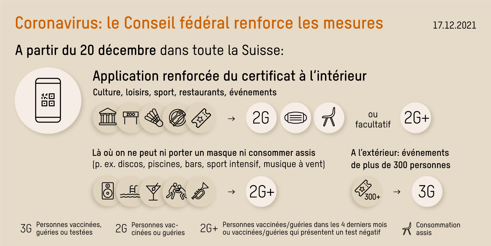

+++
title = "Janvier-Février 2022 : Parcours d'entraînements"
[menu.main]
  parent = "concours_2022"
  identifier = "2022-entr-prov"
  name = "Entraînements 2022"
  weight = 10
[menu.main.params]
  disabled = 1
+++

## Dimanches 9, 16, 23, 30 janvier, 6, 13, 20 et 27 février 2022

**2ème manège (20x40) à disposition pour l'échauffement!**

Ces entraînements se dérouleront de 09h00 à maximum 14h00. De 3 degrés chacun :

 

| Degré   | Hauteur                  | Heure      |
|---------|--------------------------|------------|
| Degré 1	| 50cm à 80cm progressif   | 09h00      |
|	Degré 2	| 90cm à 100cm progressif	 | à la suite |
|	Degré 3	| 100cm à 120cm progressif | à la suite |

## Remarques

- Deux départs par cheval par entraînement
- Un cavalier peut monter un nombre illimité de chevaux
- Aucune restriction de gains ou de licence
- le cavalier a la possibilité de choisir le degré qui lui convenant le mieux

**Pas de chrono !** 
**Pas de classement !**

- Tenue :	Bombe et bottes obligatoires
- Inscriptions : Sur place, Fr.20.- par tracé d'entraînement
- Renseignements : P. Brahier, Natel 079 / 230 26 67



Selon les directives du conseil fédéral du 17 décembre 2021, 
les manèges sont considérés comme des espaces intérieurs et ils seront donc soumis à la règle des <b>2G</b>

Seules les personnes <b>vaccinées</b> ou <b>guéries</b> peuvent accéder aux manèges et aux écuries.
Le masque est également obligatoire. Il sera possible de renoncer au port du masque si les personnes vaccinées ou guéries peuvent présenter un test négatif (2G+). Les personnes dont la vaccination, la vaccination de rappel ou la guérison datent de moins de quatre mois sont exemptées de l'obligation de se faire dépister.

Les jeunes jusqu'à 16 ans ne sont pas soumis à ces mesures !



{{}}


